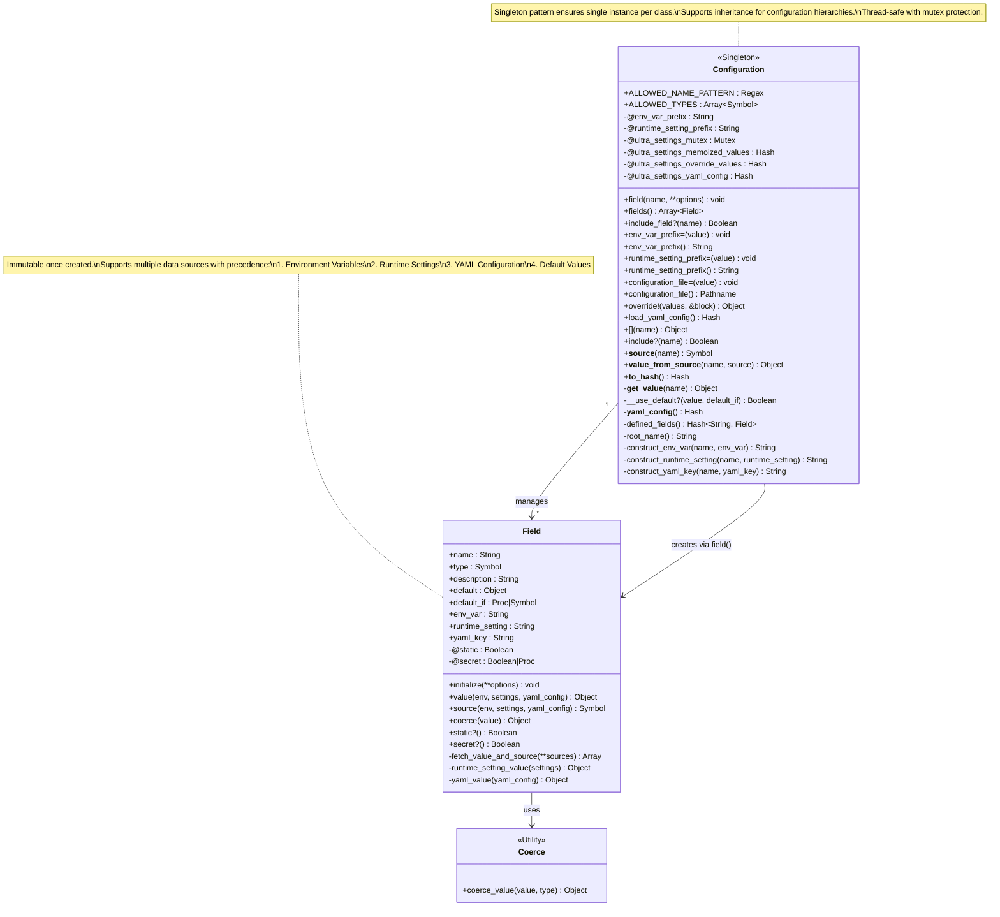

# UltraSettings Configuration Architecture

This document describes the architecture of the UltraSettings Configuration and Field classes, which form the core of the configuration management system.

## Overview

The UltraSettings library provides a flexible configuration management system built around two primary classes:

- **Configuration**: A singleton-based configuration manager that supports multiple data sources
- **Field**: A field definition that encapsulates metadata and value resolution logic

## Architecture Diagram

## Key Components

### Configuration Class

The `Configuration` class serves as the primary interface for defining and accessing configuration values. Key characteristics:

#### Singleton Pattern
- Uses Ruby's `Singleton` module to ensure one instance per configuration class
- Supports inheritance, allowing configuration subclasses to have their own singleton instances

#### Field Definition
- **`field(name, **options)`**: DSL method for defining configuration fields
- Dynamically creates getter methods using `class_eval`
- Supports various field types: `:string`, `:symbol`, `:integer`, `:float`, `:boolean`, `:datetime`, `:array`
- Validates field names against `ALLOWED_NAME_PATTERN`

#### Multi-Source Value Resolution
Fields can pull values from multiple sources in order of precedence:
1. **Environment Variables** - Highest priority
2. **Runtime Settings** - Dynamic configuration
3. **YAML Files** - File-based configuration
4. **Default Values** - Fallback values

#### Thread Safety
- Uses `Mutex` for thread-safe operations
- Protects memoized values and override values from race conditions

#### Value Overrides
- **`override!(values, &block)`**: Temporarily override field values within a block
- Thread-local overrides allow different values per thread

### Field Class

The `Field` class encapsulates the metadata and behavior for individual configuration fields:

#### Immutable Design
- All attributes are frozen upon initialization
- Ensures consistent behavior throughout the application lifecycle

#### Value Resolution Logic
- **`value(env:, settings:, yaml_config:)`**: Resolves field value from available sources
- **`source(env:, settings:, yaml_config:)`**: Identifies which source provided the value
- **`fetch_value_and_source()`**: Core resolution algorithm with source precedence

#### Type Coercion
- **`coerce(value)`**: Converts string values to appropriate types
- Delegates to `Coerce` utility class for type-specific conversion logic

#### Security Features
- **`secret?`**: Marks fields containing sensitive data
- Supports both boolean and callable (lambda) secret detection
- Secret fields are masked in serialization methods

#### Special Behaviors
- **Static Fields**: Values cached and never change after first resolution
- **Default Conditions**: Custom logic for when to use default values via `default_if`

## Data Flow

1. **Field Definition**: Developer calls `Configuration.field()` to define a configuration field
2. **Field Creation**: A new `Field` instance is created and stored in the configuration class
3. **Dynamic Method**: A getter method is dynamically created using `class_eval`
4. **Value Access**: When the getter is called, it delegates to `__get_value__`
5. **Source Resolution**: The field's `value()` method checks sources in precedence order
6. **Type Coercion**: Raw string values are coerced to the appropriate type
7. **Caching**: Static fields are memoized; others may use override values

## Key Design Patterns

### Factory Pattern
The `field()` method acts as a factory for creating `Field` instances with appropriate defaults and validations.

### Strategy Pattern
Different data sources (environment, runtime settings, YAML) are handled through a consistent interface but with source-specific logic.

### Template Method
The value resolution follows a template where the algorithm is defined in `Field#fetch_value_and_source`, but source-specific retrieval is delegated to private methods.

### Decorator Pattern
Field overrides decorate the normal value resolution with temporary alternative values.

## Inheritance Support

Configuration classes support inheritance:
- Subclasses inherit field definitions from parent classes
- Each class maintains its own singleton instance
- Prefixes and settings can be overridden per class
- Field definitions are merged from parent to child

## Thread Safety Considerations

- **Mutex Protection**: Critical sections are protected with mutex locks
- **Thread-Local Overrides**: Override values are stored per thread ID
- **Immutable Fields**: Field definitions are immutable after creation
- **Atomic Operations**: Value resolution is designed to be atomic

This architecture provides a robust, flexible, and thread-safe configuration management system that can adapt to various deployment environments and configuration sources.
