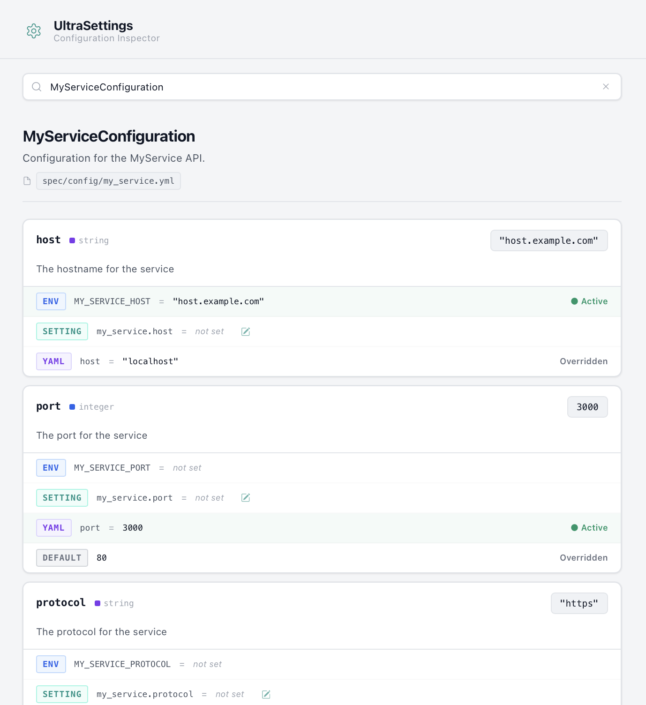

# UltraSettings :construction:

[](https://github.com/bdurand/ultra_settings/actions/workflows/continuous_integration.yml)
[](https://github.com/testdouble/standard)

This gem provides a method for managing application settings and loading their values from a variety of sources. It can help you get a handle on you application's configuration by providing a consistent method for accessing settings. It also provides a method for documenting your application's settings.

It allows you to define a hierarchy with three layers of sources for your configuration values:

1. Environment variables
2. Runtime settings (i.e. settings updatable from within the running application)
3. YAML configuration files

Settings at a higher level will override those set at a lower level. So, for instance, you can override values set in a YAML file with either environment variables or runtime settings.

Your application code, however, does not need to concern itself with how a setting value is being loaded or from what source. It can just reference configuration settings using plain old Ruby objects and methods.

Settings are also type cast so you can always be assured that values are returned as a predetermined class and your application does not need to worry about type coercion. The supported types are:

- 'String'
- 'Integer'
- 'Float'
- 'Boolean'
- 'Time'
- 'Symbol'
- 'Array<String>'

You can also define default values to be returned in case the configured value is missing or it fails to match a constraint.

Settings are accessed through singleton classes that you define.

## Usage

### Defining Configurations

Configurations are classes that extend from the `UltraSettings::Configuration` class. Configuration classes are [singleton classes](https://ruby-doc.org/3.2.2/stdlibs/singleton/Singleton.html).

You can define fields on your configuration classes with the `field` method. This will define a method on your configuration object with the given name.

```ruby
class MyServiceConfiguration < UltraSettings::Configuration
  field :host, type: :string

  field :port, type: :integer, default: 80

  field :protocol, type: :string, default: "https"

  field :timeout, type: :float, default: 1.0, default_if: ->(val) { val <= 0 }

  field :auth_token,
    type: :string,
    env_var: "MY_SERVICE_TOKEN",
    runtime_setting: false,
    yaml_key: false,
    description: "Bearer token for accessing the service"

  # You aren't limited to just defining fields, you can define other
  # helper methods to make using the configuration easier.
  def uri
    URI("#{protocol}://#{host}:#{port}")
  end
end
```

- You can specify a return type with the `:type` option. The value of the setting will be cast to this type. Valid types are:

  - `:string` (the default)
  - `:integer`
  - `:float`
  - `:boolean`
  - `:datetime`
  - `:symbol`
  - `:array` (of strings)

- You can specify a default value with the `:default` option. Note that this value will still be cast to the defined type.

- You can specify a trigger of when the default should be used with the `:default_if` option. If this option is specified, then it should be either a `Proc` or the name of a method in the class to call with the value from the settings. You can use this feature, for example, to always ensure that a value meets certain constraints.

- You can describe what your setting does with the `:description` option. This value is only for documentation purposes.

- You can override the environment variable used to populate the setting with the `:env_var` option. You can use this to point to an environment variable name that does not match the conventional pattern. You can also set this to `false` to disable loading the field from an environment variable.

- You can override the key in the YAML file with the `:yaml_key` option. You can use this to use map a setting to a key in the YAML hash if when the key doesn't match the field name. You can also set this to `false` to disable loading the field from a YAML file.

- You can override the name of the runtime setting used to populate the setting with the `:runtime_setting` option. You can use this to point to a setting whose name does not match the conventional pattern. You can also set this to `false` to disable loading the field from runtime settings.

- You can define a value as a static value by settin the `:static` option to true. Static values will not be changed once they are set. Static values also cannot be set from runtime settings. If you are referencing a setting during your application's initialization, then you should declare it as a static field.

### Environment Variables

Settings will first try to load values from environment variables. Environment variables are a good place to define environment specific values.

By default settings will be loaded from environment variables by constructing a prefix from the configuration class name (i.e. `Configs::MySettingsConfiguration` uses the prefix "CONFIGS_MY_SETTINGS_") with the field name appended to it. By default environment variables will be in all uppercase letters.

You can use lowercase environment variable names by setting `env_var_upcase` to `false` on your configuration class.

You can use a different delimiter by setting `env_var_delimiter` on your configuration class. The delimiter is used between modules and before the setting name so a delimiter of "." on `Configs::MySettingsConfiguration#setting` would produce "CONFIGS.MY_SETTINGS.SETTING".

You can set an explicit prefix by setting `env_var_prefix` on your configuration class.

You can disable environment variables as a default source on your fields by setting `environment_variables_disabled` to `true` on your configuration class.

If a setting value cannot be loaded from an environment variable, then it's value will attempt to be loaded from a runtime setting.

### Runtime Settings

Runtime settings are settings that are loaded at runtime while your application is running. The advantage to this kind of setting is that your application does not need to restart in order to get an updated value.

To use runtime settings, you need to set the `UltraSettings.runtime_settings` attribute to an object that defines the `[]` method and takes a string as the argument. For instance, if you wanted to load runtime settings from a Redis database, you could implement them like this.

```ruby
class RedisRuntimeSettings
  def initialize
    @redis = Redis.new
  end

  def [](name)
    @redis.get(name)
  end
end

UltraSettings.runtime_settings = RedisRuntimeSettings.new
```

There is a companion gem [super_settings](https://github.com/bdurand/super_settings) that can be used as a drop in implementation for the runtime settings. You would just need to set the runtime settings to the `SuperSettings` object itself.

```ruby
UltraSettings.runtime_settings = SuperSettings
```

By default settings will be loaded from runtime settings by constructing a prefix from the configuration class name (i.e. `Configs::MySettingsConfiguration` uses the prefix "configs.my_settings.") with the field name appended to it. By default runtime settings will be in all lowercase letters.

You can use uppercase runtime setting names by setting `runtime_setting_upcase` to `true` on your configuration class.

You can use a different delimiter by setting `runtime_setting_delimiter` on your configuration class. The delimiter is used between modules and before the setting name so a delimiter of "/" on `Configs::MySettingsConfiguration#setting` would produce "configs/my_settings/setting".

You can set an explicit prefix by setting `runtime_setting_prefix` on your configuration class.

You can disable runtime settings as a default source on your fields by setting `runtime_settings_disabled` to `true` on your configuration class.

If a setting value cannot be loaded from the runtime settings, then it's value will attempt to be loaded from a YAML file.

### YAML Files

The last place settings will be loaded from are from static YAML files. These can provide a good place to store default values for you application since they can be distributed with your application code.

By default settings will be loaded from a YAML file determined by its class name (i.e. `Configs::MySettingsConfiguration` uses the file "configs/my_settings.yml"). The file will be searched for in the path defined by `UltraSettings.yaml_config_path`. If the file does not exist, then settings will not use the YAML source strategy.

You can specify an explicit YAML file to use by setting `configuration_file` on your configuration class to the path to the file.

You can disable YAML files as a default source on your fields by setting `yaml_config_disabled` to `true` on your configuration class.

YAML files will be evaluated for an ERB markup (i.e. `<%= %>`) before the YAML itself is evaluated. You can use this feature to dynamically generate values within the YAML file.

YAML files define environment specific configurations. YAML files must define a hash where the keys are the names of your application environments (i.e. development, test, production, etc.). You define which environment to use with `UltraSettings.yaml_config_env` (the default environment is "development"). There is also a special key `"shared"` which, if defined, will be merged with the environment hash.

So, for this YAML file:

```yaml
shared:
  timeout: 5
  port: 8000

development:
  timeout: 10
  host: localhost

production:
  host: prod.example.com
```

The values for the "development" environment would be the combination of development and shared:

```ruby
{
  timeout: 10,
  port: 8000,
  host: "localhost"
}
```

While for "production", the values would be the combination of production and shared:

```ruby
{
  timeout: 5,
  port: 8000,
  host: "prod.example.com"
}
```

Values for the environment will always overwrite values from the shared hash.

In a Rails application, the YAML environment will be set to the Rails environment and YAML files will be assumed to exist in the `config` directory.

### Accessing settings

```ruby
# Configurations are singleton objects. Settings are accessed by calling methods.
MyServiceConfiguration.instance.host

# You can add configurations as methods onto the `UltraSettings` object.
# By default the configuration class name will be guessed (i.e. "my_service"
# maps to "MyServiceConfiguration").
UltraSettings.add(:my_service)
UltraSettings.my_service.host

# You can also specify the class name to map to a different method name.
UltraSettings.add(:my, "MyServiceConfiguration")
UltraSettings.my.host

# In a Rails application, you could add some syntactic sugar and expose
# the `UltraSettings` object as a helper method in application.rb.
module MyApp
  class Application < Rails::Application
    def settings
      UltraSettings
    end
  end
end

Rails.application.settings.my_service.host

# You can also keep things clean if your configuration is mostly accessed
# from within another class.
class MyService

  # Reference the host settings.host

  private

  def settings
    MyServiceConfiguration.instance
  end
end
```

### Web UI

There is a web UI available via a mountable Rack application. The UI will only expose the source of where settings are being loaded from. It will not show any of the setting values, but it's still highly advised to put it behind whatever authorization framework you application uses.



Here is a simple example of how to mount in a Rails application behind HTTP Basic authentication with hard coded credentials.

```ruby
# config/routes.rb

mount Rack::Builder.new do
  use Rack::Auth::Basic do |username, password|
    username == ENV.fetch("AUTH_USER") && password == ENV.fetch("AUTH_PASSWORD")
  end
  run UltraSettings::RackApp
end, at: "/ultra_settings"
```

### Testing

You can use the `UltraSettings.override!` method to force different configuration settings in you automated tests. Here's examples of overriding the `TestConfiguration#foo` value in a test block:

```ruby
# Override a configuration added on the global namespace

UltraSettings.override!(test: {foo: "bar"}) do
  expect(TestConfiguration.instance.foo).to eq "bar"
end

# or directly on the configuration class

TestConfiguration.override!(foo: "bar") do
  expect(TestConfiguration.instance.foo).to eq "bar"
end

# or on the instance itself

TestConfiguration.instance.override!(foo: "bar") do
  expect(TestConfiguration.instance.foo).to eq "bar"
end
```

If you are using RSpec, you can set up a global before handler to make it easier to specify settings within your test blocks.

```ruby
# RSpec setup
RSpec.configure do |config|
  config.around do |example|
    if example.metadata[:ultra_settings].is_a?(Hash)
      UltraSettings.override!(example.metadata[:ultra_settings]) do
        example.run
      end
    else
      example.run
    end
  end
end

# In a test
it 'has the settings I want', ultra_settings: {test: {foo: "bar"}} do
  expect(UltraSettings.test.foo).to eq("bar")
end
```

## Installation

Add this line to your application's Gemfile:

```ruby
gem "ultra_settings"
```

Then execute:
```bash
$ bundle
```

Or install it yourself as:
```bash
$ gem install ultra_settings
```

## Contributing

Open a pull request on [GitHub](https://github.com/bdurand/ultra_settings).

Please use the [standardrb](https://github.com/testdouble/standard) syntax and lint your code with `standardrb --fix` before submitting.

## License

The gem is available as open source under the terms of the [MIT License](https://opensource.org/licenses/MIT).
