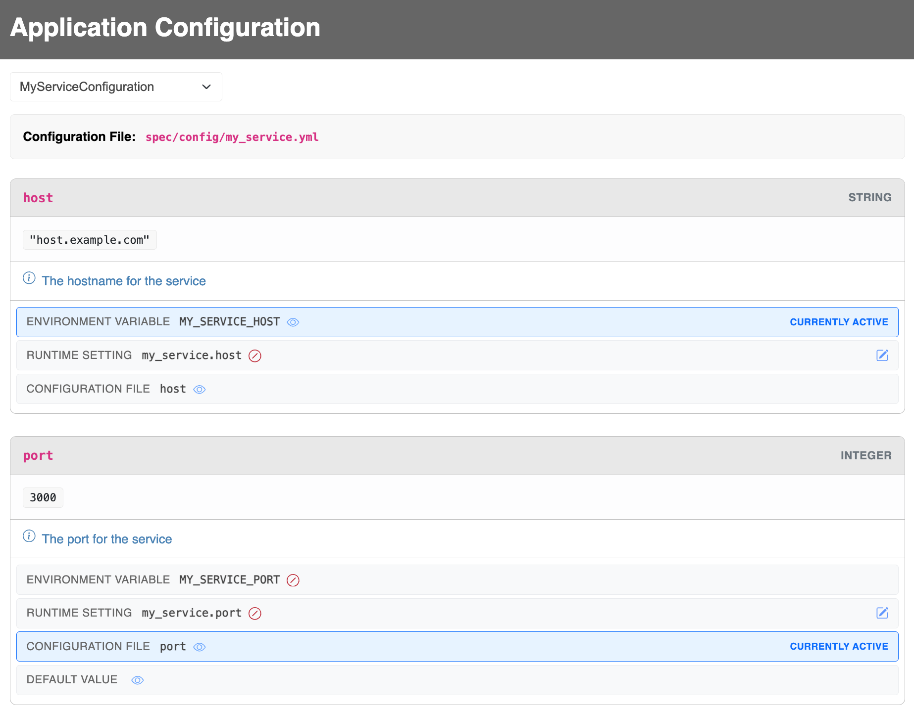

# Unified Application Configuration :construction:

[](https://github.com/bdurand/ultra_settings/actions/workflows/continuous_integration.yml)
[](https://github.com/testdouble/standard)

This gem provides a method for managing application settings. By using it you can write safer and cleaner code in your application and have a better method for documenting your various settings.

It allows you to define a hierarchy with three layers of settings:

1. Environment variables
2. Runtime settings (i.e. settings updatable from within the running application). There is a companion gem [super_settings](https://github.com/bdurand/super_settings) that can be used to provide runtime settings.
3. YAML configuration files

Settings at a higher level will override those set at a lower level. So, for instance, you can override values set in a YAML file with environment variables or runtime settings.

There is a companion gem [ultra_settings](https://github.com/bdurand/ultra_settings) that can be used to integrate SuperSettings into a combined configuration system alongside YAML files and environment variables.

It also provides type casting for setting values so you can always be assured that values are returned as a predetermined class. The supported types are:

- String
- Integer
- Float
- Boolean
- Time
- Symbol
- Array<String>

You can also define default values to be returned in case the configured value is missing or it fails to match a constraint so you can rest assured that your app won't break if someone messes up the environment variables.

Settings are accessed through singleton classes that you define.

## Usage

### Runtime Settings

Runtime settings are settings that are loaded at runtime while your application is running. The advantage to this kind of setting is that your application does not need to restart in order to get an updated value.

To use runtime settings, you need to set the `runtime_settings` attribute to an object that defines the `[]` method and takes a string as the argument. For instance, if you wanted to load runtime settings from a Redis database, you could implement them like this.

```ruby
class RedisRuntimeSettings
  def initialize
    @redis = Redis.new
  end

  def [](name)
    @redis.get(name)
  end
end

UltraSettings.runtime_settings = RedisRuntimeSettings.new
```

There is a companion gem [super_settings](https://github.com/bdurand/super_settings) that can be used as a drop in implementation for the runtime settings. You would just need to set the runtime settings to the `SuperSettings` object itself.

```ruby
UltraSettings.runtime_settings = SuperSettings
```

### Defining Configurations

Configurations are classes that extend from the `UltraSettings::Configuration` class. Configuration classes are [singleton classes](https://ruby-doc.org/3.2.2/stdlibs/singleton/Singleton.html).

You can define fields on your configuration classes with the `field` method. This will define a method on you configuration object with the given name.

You can specify a return type with the `:type` option. The value of the setting will be cast to this type. Valid types are:

- :string (the default)
- :integer
- :float
- :boolean
- :datetime
- :symbol
- :array (of strings)

You can specify a default value with the `:default` option. Note that this value will still be cast to the proper type.

You can specify a trigger of when the default should be used with the `:default_if` option. If this option is specified, then it should be either a `Proc` or the name of a method in the class to call with the value from the settings. You can use this feature, for example, to always ensure that a value meets certain constraints.

TODO description

TODO env_var

TODO yaml_key

TODO runtime_setting

```ruby
class MyServiceConfiguration < UltraSettings::Configuration
  field :host, type: :string

  field :port, type: :integer, default: 80

  field :protocol, type: :string, default: "https"

  field :timeout, type: :float, default: 1.0, default_if: ->(val) { val <= 0 }

  field :auth_token,
    type: :string,
    env_var: "MY_SERVICE_TOKEN",
    runtime_setting: false,
    yaml_key: false,
    description: "Bearer token for accessing the service"

  # You aren't limited to just defining fields, you can define other
  # helper methods to make using the configuration easier.
  def uri
    URI("#{protocol}://#{host}:#{port}")
  end
end
```

TODO env_var_prefix, env_var_delimiter, env_var_upcase

TODO runtime_setting_prefix, runtime_setting_delimiter, runtime_setting_upcase

TODO configuration_file, yaml_config_path, yaml_config_env

TODO environment_variables_disabled, runtime_settings_disabled, yaml_config_disabled

### Accessing settings
```ruby
# Configurations are singleton objects.
MyServiceConfiguration.instance.host

# You can add configurations as methods onto the `UltraSettings` object.
# By default the configuration class name will be guessed (i.e. "my_service"
# maps to "MyServiceConfiguration").
UltraSettings.add(:my_service)
UltraSettings.my_service.host

# You can also specify the class name to map to a different method name.
UltraSettings.add(:my, "MyServiceConfiguration")
UltraSettings.my.host

# In a Rails application, you could add some syntactic surgar and expose
# the `UltraSettings` object on a helper method in application.rb.
module MyApp
  class Application < Rails::Application
    def settings
      UltraSettings
    end
  end
end

Rails.application.settings.my_service.host

# You can also keep things clean if your configuration is mostly accessed
# from within another class.
class MyService

  # Reference the host settings.host

  private

  def settings
    MyServiceConfiguration.instance
  end
end
```

### Web UI

There is a web UI available via a mountable Rack application. The UI will only expose the source of where settings are being loaded from. It will not show any of the setting values, but it's still highly advised to put it behind whatever authorization framework you application uses.



Here is a simple example of how to mount in a Rails application behind HTTP Basic authentication with hard coded credentials.

```ruby
# config/routes.rb

mount Rack::Builder.new do
  use Rack::Auth::Basic do |username, password|
    username == ENV.fetch("AUTH_USER") && password == ENV.fetch("AUTH_PASSWORD")
  end
  run UltraSettings::RackApp
end, at: "/ultra_settings"
```

### Testing

You can use the `UltraSettings.override!` method to force different configuration settings in you automated tests. Here's an example of overriding the `TestConfiguration#foo` value in a test block:

```ruby
UltraSettings.override!(test: {foo: "bar"}) do
  expect(TestConfiguration.instance.foo).to eq "bar"
end
```

If you are using RSpec, you can set up a global before handler to make it easier to specify settings within your test blocks.

```ruby
# RSpec setup
RSpec.configure do |config|
  config.around do |example|
    if example.metadata[:ultra_settings].is_a?(Hash)
      UltraSettings.override!(example.metadata[:ultra_settings]) do
        example.run
      end
    else
      example.run
    end
  end
end

# In a test
it 'has the settings I want', ultra_settings: {test: {foo: "bar"}} do
  expect(UltraSettings.test.foo).to eq("bar")
end
```

## Installation

Add this line to your application's Gemfile:

```ruby
gem "ultra_settings"
```

Then execute:
```bash
$ bundle
```

Or install it yourself as:
```bash
$ gem install ultra_settings
```

## Contributing

Open a pull request on [GitHub](https://github.com/bdurand/ultra_settings).

Please use the [standardrb](https://github.com/testdouble/standard) syntax and lint your code with `standardrb --fix` before submitting.

## License

The gem is available as open source under the terms of the [MIT License](https://opensource.org/licenses/MIT).
